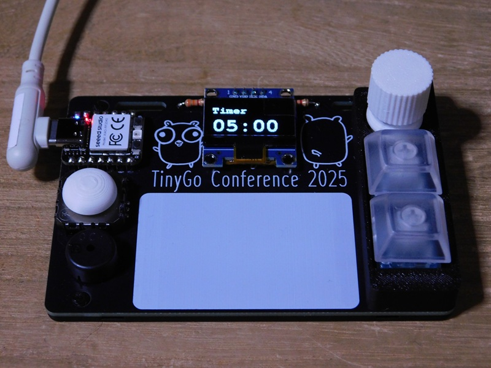
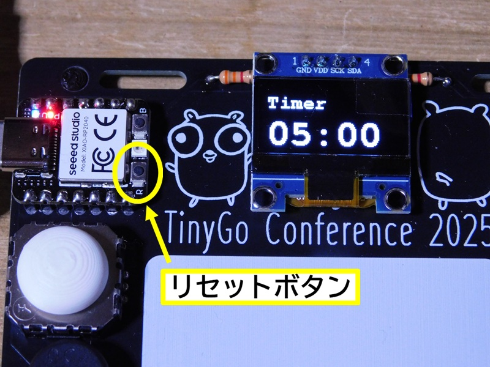

# タイマー



シンプルなカウントダウンタイマーです。  

* 初期設定は、5分に設定されています。
* ロータリーエンコーダを回すと、設定時刻を変更できます。設定時間は、1秒単位で最大99分99秒まで設定できます。
* ロータリーエンコーダのトップを押すと、カウントダウンをスタートし、もう一度押すと、一時停止します。
* 一時停止中に、ロータリーエンコーダを押すと、カウントダウンを再開します。
* カウントダウンが終わると、停止して終了音を鳴らします。
* ロータリーエンコーダのトップを長押しすると、スタート時の設定時刻を再設定します。
* リセット機能は、実装していません。マイコンボードの **リセットボタン** を押して下さい。




### コンパイル方法  

必要に応じて、以下のパッケージを導入して下さい。  

```bash
> go get tinygo.org/x/drivers
> go get tinygo.org/x/drivers/tone
> go get tinygo.org/x/tinydraw
> go get tinygo.org/x/tinyfont
> go mod tidy
```

ソースコードは、[main.go](./main.go) です。  
このソースコードのあるディレクトリに移動して、以下のコマンドを実行して下さい。コンパイルが完了すると、生成した実行用バイナリがマイコンボードに転送されます。  

```bash
> tinygo flash --target xiao-rp2040 --size short -monitor .
```

また、実行用バイナリを転送できない場合は、以下のコマンドで、実行用バイナリを作成し、手作業で、実行用バイナリをzero-kb02に転送して下さい。  

```bash
> tinygo build -o timer.uf2 --target xiao-rp2040 --size short .
```

### 応用例

conf2025badge は、首に掛けて使うことを前提に作られています。  
発表時間が限られているLTに、このタイマーを使ってみてはどうでしょう？  
conf2025badge で、活動限界の5分間にチャレンジしてみて下さい。
